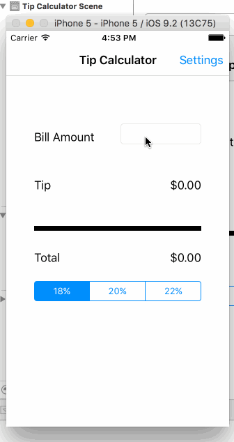

# TipCalculator Application

This is a Tip Calculator application for iOS submitted as the [pre-assignment](https://github.com/leovinh/Tip-Calculator-application.git) requirement for Coderschool.

Language: Swift

Completed:

* [x] Required: User can enter a bill amount, choose a tip percentage, and see the tip and total values.

Pending:
* [x] Required: Settings page to change the default tip percentage. I still read document to finish this task soon

GIF created with [LiceCap](http://www.cockos.com/licecap/).

